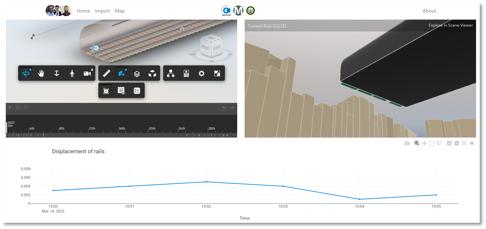

# BIM-IoT-3D GIS Platform

[](https://nodejs.org)
[](https://react.dev/)
[](https://yarnpkg.com/)

A React app for real-time monitoring of railroad infrastructure. It was developed as part of my engineering thesis at School of Geomatics and Surveying Engineering ([Hassan II Institute of Agronomy and Veterinary Medicine](https://www.iav.ac.ma/)).



## Technologies used

- [APS (formerly Forge)](https://aps.autodesk.com/): It was used to host the 3D model of the railroad infrastructure. We also relied on [APS DataViz Extensions](https://github.com/autodesk-platform-services/aps-iot-extensions-demo) to display real-time data on the 3D model.
- [ArcGIS Online](https://www.arcgis.com/index.html): Mainly used to publish our Indexed 3D Scene Layers (I3S).
- [React](https://reactjs.org/): Used to develop the web app.
- [Docker](https://www.docker.com/): Used to deploy our OGC SensorThings API server and PostgreSQL database.

## FROST-Server

``` shell
# Go to api folder
$ docker-compose up

# Access postgis container using CLI
$ docker exec -ti frost-db-container psql -U sensorthings
```

To access FROST-Server, go to [http://localhost:8080/FROST-Server/](http://localhost:8080/FROST-Server/)
